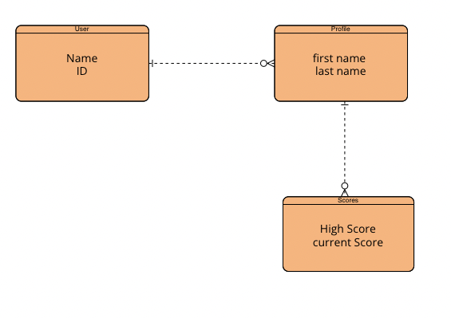
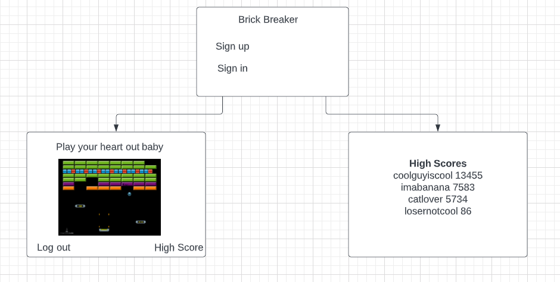

# Brickbreaker
## Introduction
A simple game of brickbreaker that we all know and love.

## Set Up Instructions
- Fork and clone this repository
- Change into directory
- Checkout to a new branch
- Run ``npm install`` in the command line
- Run ``npm start`` in the command line

## Project Planning 
- Layed out plan for MVP of CRUD actions
- Created a set schedule for having MVP done by due date
- Planned how I would work on each section at a time starting with backend then frontend
- Made sure canvas game would work in React
## User Stories
1. Sign Up: If you're a first time user, sign up with your email and password.
2. Sign In: If you're already registered, congrats! Click 'Sign In.' Change your password if needed.
3. Creating a Profile: Create your own profile and make edits/delete if desired.
4. Game: Enter the game and play!
5. High Scores: View yours and others high scores.
  
- User will be able to sign up.
- User will be able to sign in, sign out and change password.
- User will create a profile and be able to edit/delete profile.
- User will be able to play the game.
- User will be able to view their high scores and others high scores.

## API Routes
### _Profile Routes_

| HTTP Method   | URL Path        | Result               | Action           |
|:--------------|:----------------|:---------------------|:-----------------|
| GET           | /profiles       | read list of profiles| index or list    |
| GET           | /profiles/`:id` | read single profile  | show or retrieve |
| POST          | /profile        | create profile       | create           |
| PATCH         | /profiles/`:id` | update profile       | update           |
| DELETE        | /profiles/`:id` | delete profile       | destroy          |

### _Score Routes_

| HTTP Method   | URL Path        | Result               | Action           |
|:--------------|:----------------|:---------------------|:-----------------|
| GET           | /scores         | read list of scores  | index scores     |
| POST          | /scores         | adds score to list   | adds score       |

## Technologies Used

|    Libraries      | Languages        | Frameworks              | Database          | Version Control
|:-----------------------------------------|:----------------|:---------------------|:-----------------|:-----------------|
| [React.js](https://reactjs.org/)       |    [HTML](https://developer.mozilla.org/en-US/docs/Web/HTML)        |  [Express](https://expressjs.com/) | [MongoDB](https://www.mongodb.com/)   | [GitHub](https://github.com/) |[Javascript](https://www.javascript.com/)          | [BootStrap](https://getbootstrap.com/)       |           |
|  [Axios](https://www.npmjs.com/package/axios)         | [CSS](https://developer.mozilla.org/en-US/docs/Web/CSS)          |        |          |
|    [Mongoose](https://mongoosejs.com/)        |           |        |         |
|          |          |       |         |
### Entity Relationship Diagram

### Wireframe

  
### Opportunities for Future Iterations
- Fixing paddle physics, specifically left side of paddle when hit ball falls through
- Fixing ball physics, specifically when hit on left side of paddle, ball dips down past paddle then up to the right hand side of field of view
- Implementing scores, including saving high scores
- Implementing users usernames into the actual game

### [Link to Back End Repo](https://github.com/ms00l/brickbreakSERVER)
### Links to Deployed Sites:
- [Link to the API Deployed](https://intense-beyond-99955.herokuapp.com)
- [Link to the Client Deployed](https://ms00l.github.io/brickbreakCLIENT/)